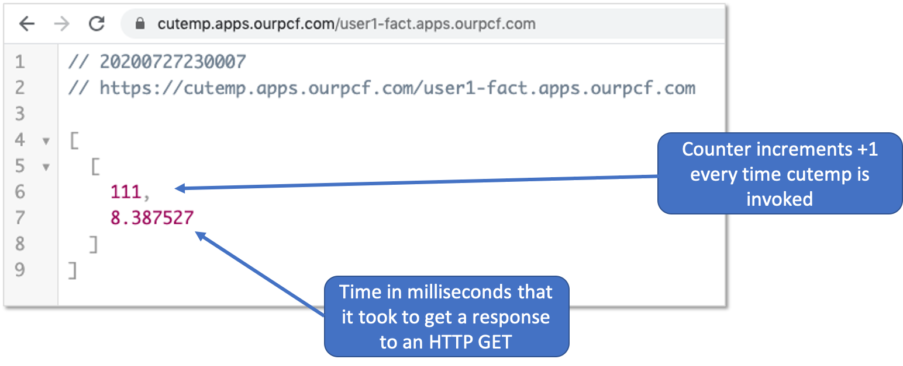
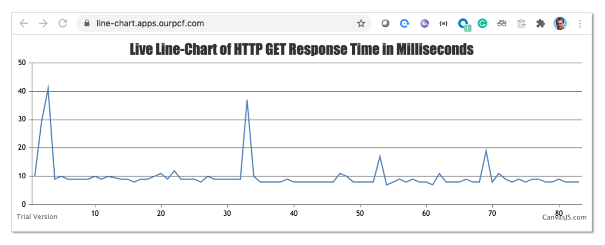

# line-chart
Line-chart is basically some JavaScript code for the display of http get response times in milliseconds

# line-chart is meant to be used with [cutemp](http://github.com/rm511130/cutemp)

Line-chart's `index.php` file contains two identical lines that look like this:

```
 $.getJSON("https://cutemp.apps.ourpcf.com/user1-fact.apps.ourpcf.com/10000", function(data)
```

The code simply executes an HTTP GET on `https://cutemp.apps.ourpcf.com` which in turn executes an HTTP GET on `http://user1-fact.apps.ourpcf.com/10000`. The `cutemp` code returns a key-value pair in json format, for example:



When [cutemp](http://github.com/rm511130/cutemp) is used in conjunction with Line-chart, you get a dynamically updated Line-chart of the HTTP GET response time for `http://user1-fact.apps.ourpcf.com/10000` or any other URL you care to place after `https://cutemp.apps.ourpcf.com/`



# Easy to cf push

You can cf push Line-chart to any Tanzu Application Services platform as shown in the example below:

```
cf login -a api.sys.ourpcf.com -u rm511130 -p p@55w0rd
cf push line-chart
```
